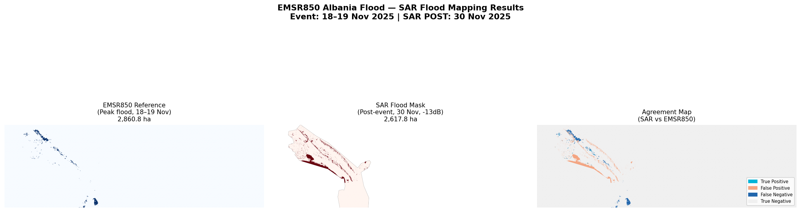

# EMSR850 Albania Flood Mapping Pipeline

SAR-based flood extent mapping for the Albania riverine flood event (18-19 November 2025), using Copernicus Emergency Management Service activation EMSR850 as ground truth.

## Event Summary
- **Event**: Riverine flood, Albania, night of 18-19 November 2025
- **Activation**: Copernicus EMS EMSR850
- **AOIs**: 4 (AOI02, AOI03, AOI05, AOI06)
- **Official flood extent**: 2,860.8 ha

## Results
| Metric | Value |
|--------|-------|
| SAR Flood Area | 2,617.8 ha |
| vs Reference | -8.5% |
| Threshold | -13 dB (VV, Otsu-guided) |
| F1 Score | 0.054 |
| Note | 12-day temporal gap — flood receded by acquisition date |

## Data Sources
- **Sentinel-1 GRD** (CDSE API): PRE 17-Nov-2025, POST 30-Nov-2025
- **Sentinel-2 SR** (Google Earth Engine): PRE 22-Sep-2025, POST 29-Dec-2025
- **SRTM DEM + terrain** (GEE)
- **GPM IMERG rainfall** (GEE)
- **GHSL population + built-up** (GEE)
- **Reference**: Copernicus EMS EMSR850 DEL products

## Pipeline Steps
| Script | Phase | Description |
|--------|-------|-------------|
| 01_download_emsr850.py | Phase 1 | Download and merge EMSR850 reference products |
| 02_search_sentinel1.py | Phase 3 | Search Sentinel-1 scenes via CDSE API |
| 03_download_sentinel1.py | Phase 3 | Download Sentinel-1 scenes |
| 04_gee_sentinel2_export.py | Phase 4 | Export Sentinel-2 via GEE |
| 05_gee_dem_terrain.py | Phase 5 | Export DEM/slope/aspect via GEE |
| 06_gee_rainfall.py | Phase 6 | Export GPM rainfall via GEE |
| 07_gee_exposure.py | Phase 7 | Export GHSL layers via GEE |
| 08_snap_processing.sh | Phase 8 | SAR preprocessing in SNAP 13 |
| 09_flood_mask.py | Phase 9 | Flood mask extraction at -13 dB |
| 10_validation.py | Phase 10 | Validation against EMSR850 reference |

## Environment
- Ubuntu 24.04 (Incus container)
- Python 3.12 + venv
- ESA SNAP 13.0.0
- Google Earth Engine Python API

## Requirements
pip install -r requirements.txt

## Author
Anuj Nathani
MSc ICT & Internet Engineering, University of Rome Tor Vergata
